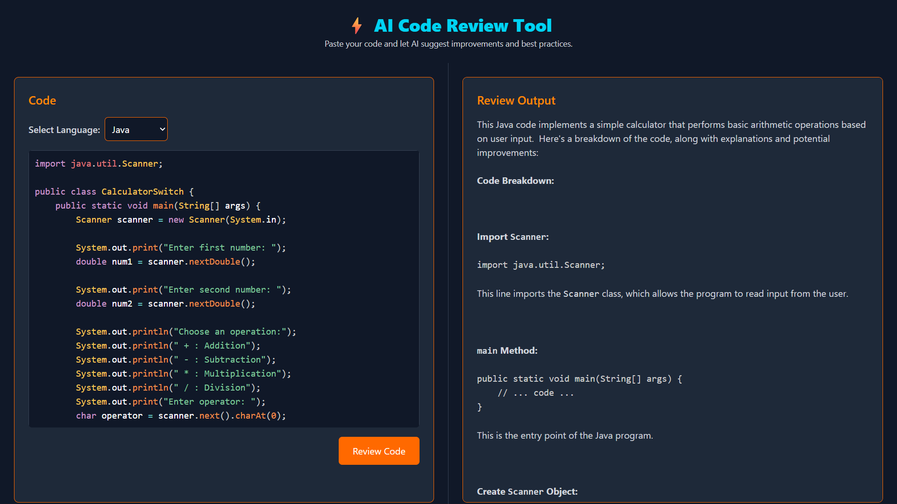

# 🧠 Code Reviewer with Gemini API

This is a web application that allows users to select a programming language, paste their code, and receive an AI-powered review. The review includes error detection, suggestions for best practices, and code improvements — powered by the **Gemini API**.

## 🚀 Features

- 🌐 Language selection (e.g., JavaScript, Python, Java, etc.)
- 🧾 Paste code and get an instant AI review
- ❌ Identifies errors and bugs
- ✅ Suggests improved and optimized code
- 🛠️ Explains best coding practices
- 🎨 Syntax highlighting for pasted code
- ⚡ Built with **React (frontend)** and **Node.js + Express (backend)**
- 🔮 AI support via **Gemini API**

## 🖼️ Demo



## 🛠️ Tech Stack

| Frontend     | Backend        | AI Engine   |
|--------------|----------------|-------------|
| React        | Node.js + Express | Gemini API |

## 📦 Installation

### 1. Clone the Repository

```bash
git clone https://github.com/Sandipan-seth/CodeReviewer
cd code-reviewer
```

### 2. Install Dependences
open two Terminal
```bash
cd FrontEnd
npm install 
npm run dev
```
```bash
cd BackEnd
npm install 
npm start
```

### 3. .env file in BackEnd
```bash
GOOGLE_GEMINI_KEY= your api key
```

### 4. .env file in FrontEnd
```bash
VITE_BACKEND_URL= your backend URL
```